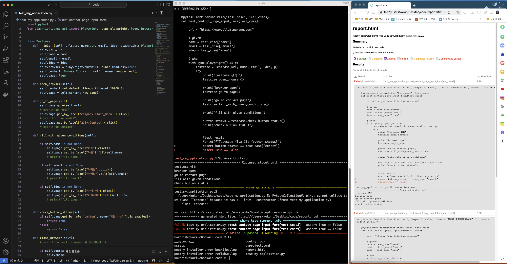

# illuminarean
일루미나리안 test automation engineer 직군 사전과제

# 설치 라이브러리
1. pytest
2. pytest-playwright

# 실행 방법
1. repo clone 
2. 터미널에서 Repo 디렉토리로 이동 
3. `pytest --html=report.html --self-contained-html test_my_application.py` 명령어 실행

# 실행 결과

# 코드 구조 및 설명
- `Testcase` 라는 이름의 클래스 만들고 `Testcase` 타입의 10개의 테스트 케이스 생성
- given - when - then 의 구조를 고려
- 스크립트 실행순서 : 홈페이지 -> 모달 닫기 -> 컨택트 페이지 이동 -> 테스트 케이스 입력 -> 버튼 활성화 여부 확인
- html report 출력과 코드 간결화을 위해 테스트 케이스를 파라미터화하여 함수 구현 

# 더 해보고 싶었던 것들

 - xss, 최대 입력값 검증
 - pytest-html을 이용하여 보고서에 각 테스트케이스별 결과와 스크린샷 포함 시키기
 - 테스트 커버리지 구해보기
 - 이름의 입력값에 특수문자와 숫자의 입력은 괜찮은건지 의논해보기

