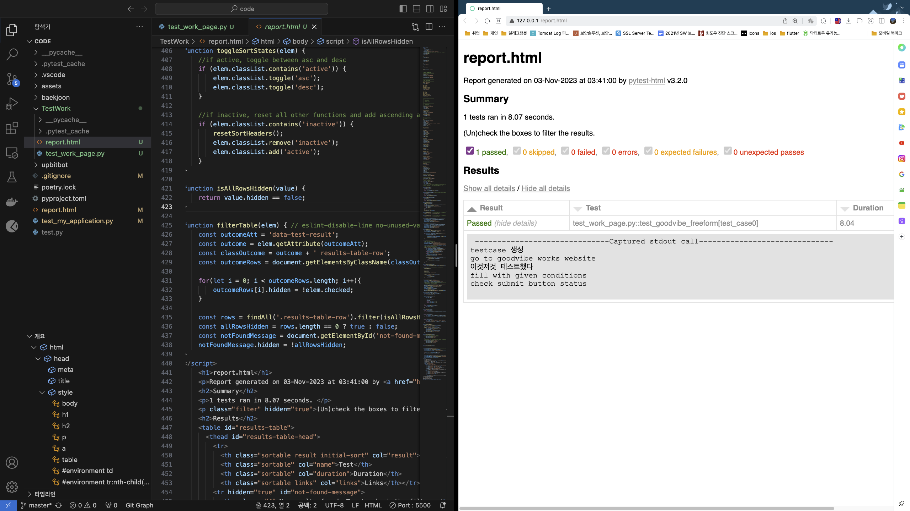

# illuminarean/TestWork
일루미나리안 test automation engineer 직군 사전과제

# 설치 라이브러리
1. pytest
2. pytest-playwright

# 실행 방법
1. repo clone 
2. 터미널에서 Repo 디렉토리로 이동 
3. `pytest --html=report.html --self-contained-html test_work_page.py` 명령어 실행

# 실행 결과

# 특이사항 
- 새 윈도우를 여는 등 기존 과제와 달라진 점을 고려하여 전체 async - await 비동기 방식 선택 
- 페이지가 모두 로드될 때까지 자동으로 기다릴 수 있어 새 윈도우를 여는 작업(링크 클릭)에 적절하다고 생각함

# 코드 구조 및 설명
- `Testcase` 라는 이름의 클래스 만들고 `Testcase` 타입 테스트 케이스 생성 
- 시간관계상 버튼이 활성화되는 1개의 경우만 테스트, testcase만 넣으면 되기 때문에 케이스 추가 가능
- given - when - then 의 구조를 고려
- 스크립트 실행순서 : 홈페이지 -> 모달 닫기 -> works 이동 -> goodvibe 홈페이지 이동 -> 무료 체험 신청 버튼 클릭
- html report 출력과 코드 간결화을 위해 테스트 케이스를 파라미터화하여 함수 구현 

# 더 해보고 싶었던 것들

 - xss, 최대 입력값 검증
 - pytest-html을 이용하여 보고서에 각 테스트케이스별 결과와 스크린샷 포함 시키기
 - 테스트 커버리지 구해보기
 - 이름의 입력값에 특수문자와 숫자의 입력은 괜찮은건지 의논해보기(입력값 validation 관련)
 - 필수 입력 칸은 어떤것들을 넣을지 확인
 - 담당업무가 선택형 이어야할 이유가 있을까? 고민해보기
 - "무료 체험 신청" 버튼이 상단 배너랑 본문에 있는데 두개 다 버튼 눌러보는 시나리오 해보기

